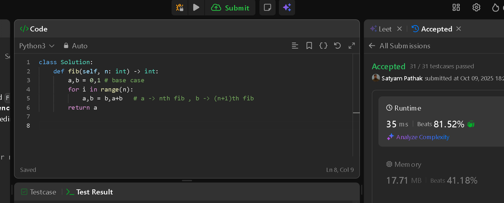
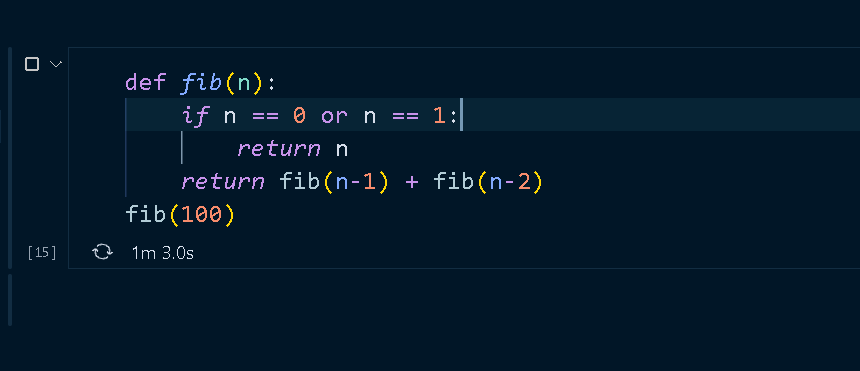

# Topics_Covered:-

1. Fibonacci Number

### NOT RECOMMENDE💀💀💀

## OPTIMAL
 
    def fib(n):
        a = 0
        b = 1
        for i in range(n):
            a, b = b, a + b
        return a

    fib(10000)