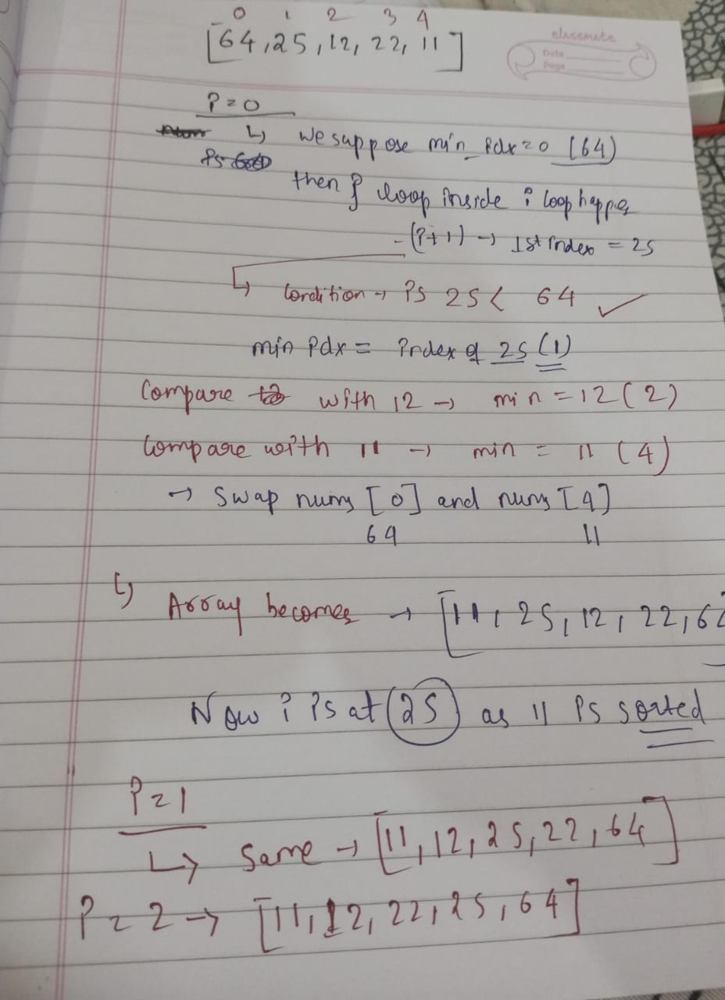
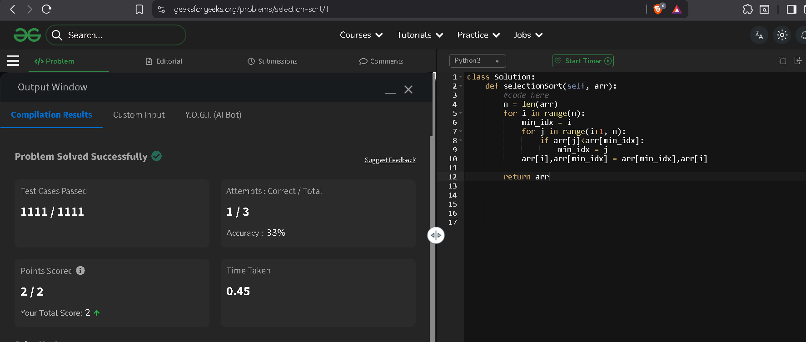

# Topic_Covered:-

1. Selection Sort -> ascending + in descending

## Dry run
  

## CODE (ascending)

    nums = [64, 25, 12, 22, 11]
    def selection_sort(nums):
        n = len(nums)
        for i in range(0,n):
            min_idx = i
            for j in range(i+1,n):
                if nums[j] < nums[min_idx]:
                    min_idx = j 
            nums[i],nums[min_idx] = nums[min_idx],nums[i]
        return nums
    print("Sorted array is:", selection_sort(nums))

## CODE (descending)

    nums = [64, 25, 12, 22, 11]
    def selection_sort(nums):
        n = len(nums)
        for i in range (n):
            max_idx = i
            for j in range (i+1,n):
                if nums[j] > nums[max_idx]:
                    max_idx = j
            nums[i],nums[max_idx] = nums[max_idx],nums[i]
        return nums
    print("Sorted array in reverse order is:", selection_sort(nums))

