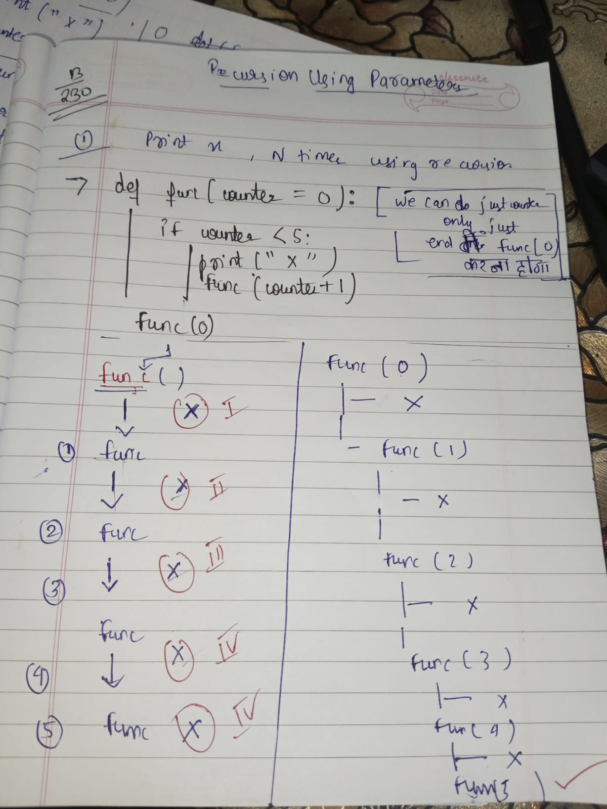
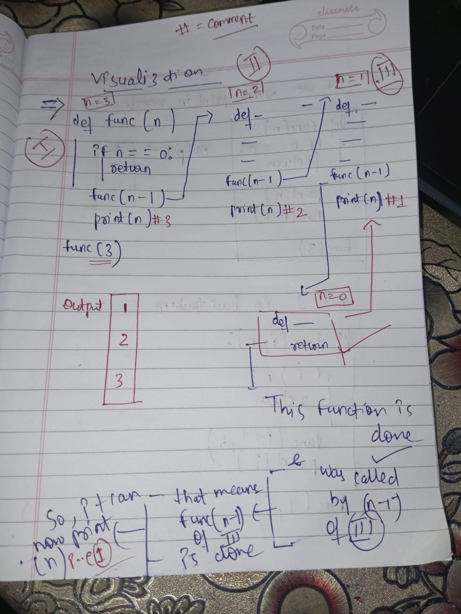

# Recursion..continued .. 

1. Recursion using parameters

 ## snippet
    def func(counter ): 
        if counter < 5:
            print("X")
            func(counter + 1)
    func(0)
### Recursion tree

## Printing 1 to n (tail recursion)

        def func(n):
            if n==0:
                return
            func(n-1)
            print(n)
        func(5)

